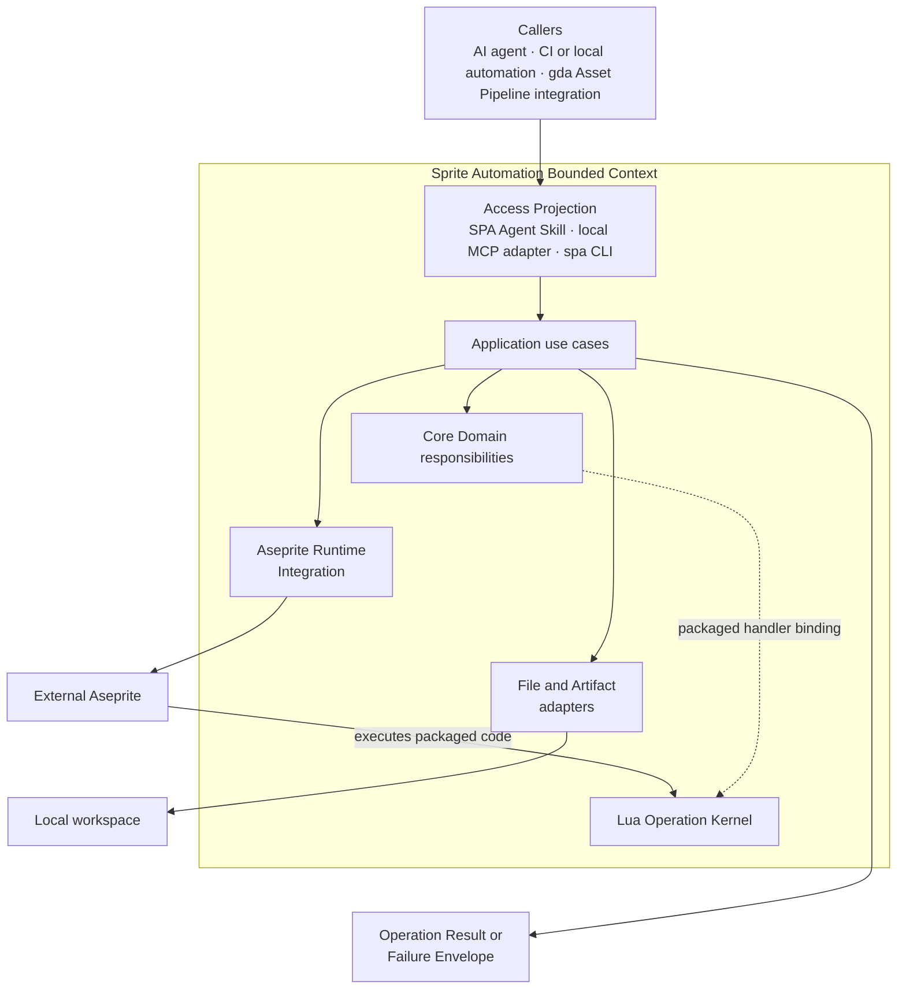
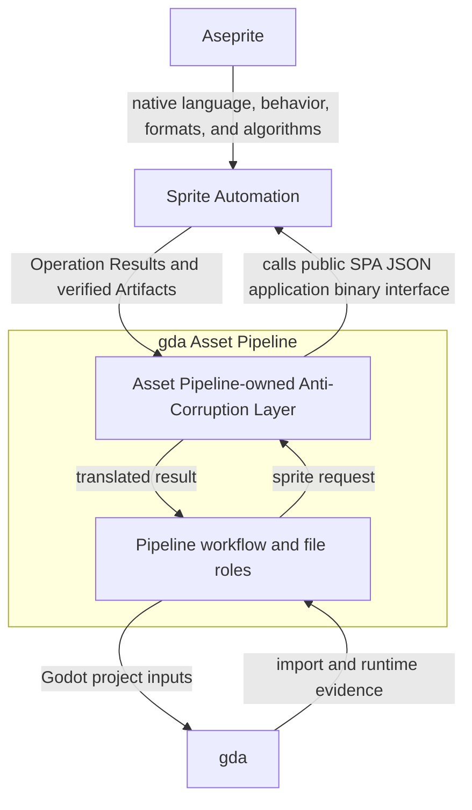
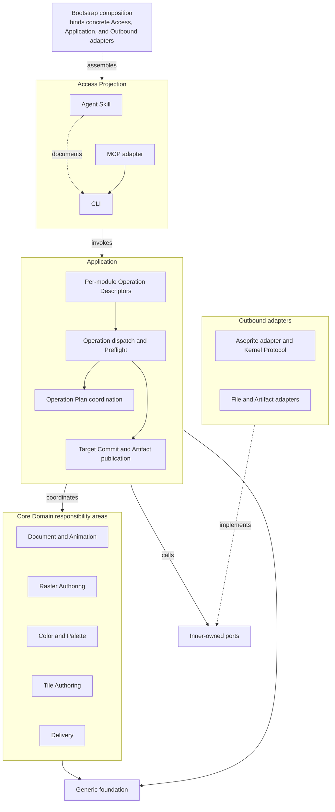
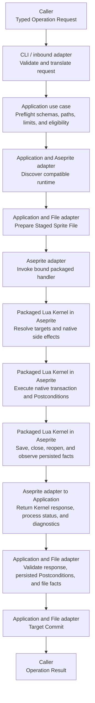
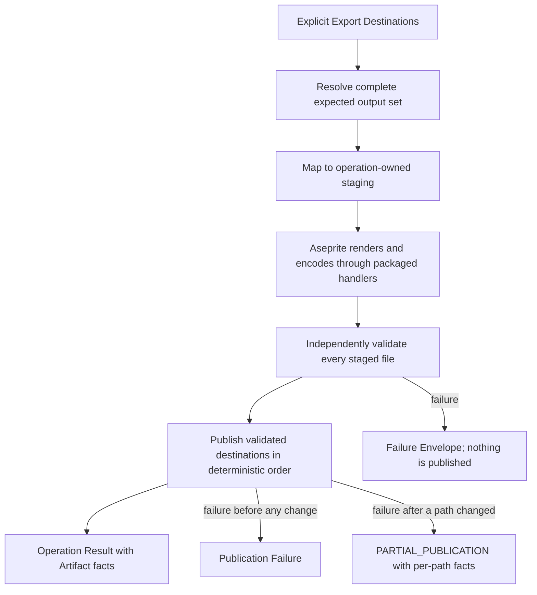

# SPA Architecture

This document presents the current system architecture of Aseprite Automation (`spa`).
It integrates the accepted domain model and architecture decisions into one view for
users and contributors. It describes responsibilities, boundaries, dependencies, and
execution flows without replacing the documents that own individual decisions or
feature contracts.

> [!IMPORTANT]
> SPA is at the bootstrap stage. This document describes the accepted architecture and
> planned module ownership; it does not claim that a capability has shipped. Feature
> issues own delivery status, and the installed Surface Manifest will own the callable
> surface of a released installation.

The document evolves with the product. An accepted change to the Bounded Context,
module ownership, public contract, execution model, or integration boundary must be
reflected here after its owning artifact changes.

## Architecture at a glance

SPA is an **Aseprite automation toolchain for AI agents**. Its business capability is
equivalent to Aseprite's: it provides agent-facing mechanisms for sprite creation,
editing, inspection, validation, conversion, and export, and develops these functional
capabilities broadly and deeply for agent use.

SPA exposes those capabilities as typed Operations with explicit targets, structured
outcomes, and verifiable Artifacts. It invokes an externally installed Aseprite, which
remains authoritative for native sprite behavior.



Arrows in this overview show runtime collaboration and output flow, not source-code
dependencies. The [logical module architecture](#logical-module-architecture) defines
the source dependency direction.

The primary working loop is:

```text
discover
    -> inspect existing state when applicable
    -> create or edit
    -> inspect and validate the persisted result
    -> continue editing or export
```

The create/edit and inspect/validate steps repeat as the agent refines an asset.

The `spa` CLI is the first Open Host Service. The Agent Skill and current local Model
Context Protocol (MCP) adapter project the installed CLI surface instead of defining
parallel behavior. The current delivery plan does not include a standalone REST API or
remote HTTP service. HTTP is not excluded as a future transport: a validated functional
workflow can add bounded Artifact/resource access or MCP transport as another Access
Projection over the same Published Language and Application use cases.

## Architecture drivers

The architecture responds to six product needs:

1. **Aseprite-equivalent business capability.** SPA must make Aseprite creation,
   editing, inspection, validation, conversion, and export practical for agents.
2. **Clear behavior authority.** Aseprite remains authoritative for native objects,
   pixels, Tools, Filters, color, and export behavior. Each packaged Lua handler is the
   authority for its SPA Core Operation Semantics and native mapping.
3. **Explicit agent intent.** An Operation must not depend on active editor objects,
   saved preferences, prompts, or other hidden interactive state.
4. **Machine-readable outcomes.** Inputs, successes, failures, side effects, bounds,
   and installed support must have typed and discoverable representations.
5. **Verifiable persistence.** A process exit is not sufficient evidence. Mutated
   Sprites and exported Artifacts must be staged, inspected, and reported truthfully.
6. **Incremental product growth.** Core functional slices lead architecture growth.
   Supporting and Generic mechanisms grow when delivered capabilities require them.

These drivers come from the
[umbrella product requirements document (PRD)](https://github.com/aigengame/aseprite-automation/issues/1),
the [Ubiquitous Language and context model](CONTEXT.md), and the
[accepted ADRs](docs/adr/).

## Domain-driven design profile

### One Bounded Context

SPA has one **Sprite Automation Bounded Context**. Creation, editing, inspection,
validation, conversion, and export use the same Aseprite object model and the same
agent-facing automation contract. CLI, MCP, Agent Skill, validation, export, runtime
integration, and the Lua Operation Kernel are modules or adapters inside this context;
they are not separate Bounded Contexts.

The system uses Aseprite's public language where Aseprite already names a concept.
SPA adds terms when agent automation needs a distinct public value, lifecycle, or
contract. [`CONTEXT.md`](CONTEXT.md#ubiquitous-language) is the terminology authority.

### Subdomains and investment

| Subdomain | Classification | Responsibility | Investment rule |
| --- | --- | --- | --- |
| Sprite Automation | Core Domain | Agent-facing Aseprite creation, editing, inspection, validation, conversion, export, control, composition, and feedback. | Highest priority; deepen through functional vertical slices. |
| Aseprite Runtime Integration | Supporting | Runtime and resource discovery, process execution, Kernel transport, staging integration, and native integration facts. | Grow from Core Domain needs and observed runtime variation. |
| Access Projection | Supporting | CLI presentation, Agent Skill guidance, and MCP projection from one operation surface. | Preserve contract equivalence; do not create a second capability model. |
| Asset Pipeline Integration | Supporting | Maintain the public SPA boundary used by the downstream-owned Anti-Corruption Layer. | Follow the stable integration commitment without adopting experimental pipeline internals. |
| Serialization, filesystem, process, and utilities | Generic | Domain-neutral mechanics required by accepted Operations. | Use proportionate solutions; no independent platform roadmap. |

This priority is a design constraint. Authentication, authorization, audit history,
distributed consistency, multi-tenancy, and similar service infrastructure do not enter
the design without an accepted functional need and operating evidence.

### Context relationships



- **Aseprite is upstream.** SPA shares its native language and delegates native
  behavior through supported non-interactive seams.
- **The Asset Pipeline is downstream.** Its Anti-Corruption Layer translates pipeline
  concepts to the public SPA JSON application binary interface (ABI). Experimental
  pipeline command names and types do not become SPA contracts.
- **gda owns Godot evidence.** SPA can verify a Sprite or exported image, but it does
  not claim Godot import, runtime, gameplay, or player acceptance.
- **Callers own cross-Sprite workflows.** Aggregation, retry, installation, and project
  acceptance remain outside one SPA Operation or Operation Plan.

### Selective use of DDD building blocks

SPA uses Domain-Driven Design (DDD) to assign language and responsibility, not to
reproduce a pattern catalog.

| Building block | SPA use |
| --- | --- |
| Ubiquitous Language | Shares Aseprite terms, records explicit SPA extensions, and defines SPA automation terms. |
| Bounded Context | Keeps one coherent Sprite Automation model and public contract. |
| Domain Module | Owns a cohesive feature family and its reason to change across logical layers. |
| Value Object | Represents explicit values such as Color Value, Selection, Coordinate Space, Pixel Region Snapshot, Tile Placement, and Artifact facts. |
| Application use case | Coordinates work that has no natural native Aseprite object owner, such as Operation Plan execution and publication. |
| Open Host Service and Published Language | Exposes the CLI JSON ABI and its schemas to agents and downstream consumers. |
| Anti-Corruption Layer | Belongs to the Asset Pipeline and prevents pipeline models from entering SPA. |

SPA does not introduce a database Repository, an event-sourced Aggregate, or a global
event bus. The current product operates on Aseprite documents and local files through
explicit Operations.

## Logical module architecture

The architecture separates logical dependency layers while Domain Modules retain
vertical ownership of their Operations. A Command Group is navigation and does not
define a module boundary.



Source dependencies point inward. Inbound adapters invoke Application entry points.
Application coordinates Domain behavior and ports. Concrete outbound adapters depend
on the ports they implement; the Domain and Application do not depend on concrete
process, filesystem, MCP, or CLI types. Bootstrap is the location that knows concrete
implementations and binds them.

The diagram is a responsibility map, not a required directory tree. Physical packages
will follow demonstrated change clusters as vertical slices are implemented.

### Technology profile

The planned implementation uses a replaceable outer stack around stable domain and
public-contract boundaries. [Issue #3](https://github.com/aigengame/aseprite-automation/issues/3)
owns these reversible bootstrap choices until implementation records the actual runtime
and dependencies in project metadata and its lockfile.

| Component | Planned bootstrap choice | Role |
| --- | --- | --- |
| Application runtime | Python 3.13 | Use-case orchestration and adapter coordination. |
| CLI adapter | Typer | Command access and human or machine presentation. |
| Public contracts | Pydantic 2 and JSON Schema | Typed Operation Requests, Operation Results, Failure Envelopes, and discovery schemas. |
| Project and packaging | `uv` | Environments, dependencies, builds, and installed-product tests. |
| Ordinary Core Operations | Packaged Lua handlers | Core Operation Semantics and native mapping executed through Aseprite. |
| Aseprite integration | External `aseprite --batch --script` | Native document, Tool, Filter, color, and export behavior. |
| Private transport | Versioned JSON request and response files | Data exchange through `--script-param`, separate from diagnostics. |
| Agent access | Version-matched Skill and local stdio MCP adapter with CLI subprocess invocation | Guidance and equivalent tool projection from the installed surface. |

These choices can change when implementation or distribution evidence requires it.
The Bounded Context, Published Language, and behavior authority do not depend on one
Python framework or packaging tool.

## Module responsibilities

### Core Domain ownership view

The current planning view groups Core Domain responsibility into five cohesive areas.
They guide feature ownership and can become Domain Modules as implementation evidence
confirms their change boundaries. ADR-0018 already establishes Raster Authoring as a
Domain Module; the other groupings remain an integrated planning view rather than a
frozen package graph.

| Responsibility area | Owns | Important boundary |
| --- | --- | --- |
| Document and Animation | Sprite, Layer, Frame, Cel, Tag, Slice, timing, hierarchy, lifecycle, and animation inspection or authoring Operations. | Uses native one-based Frame and object semantics; it does not infer active editor targets. |
| Raster Authoring | Image observation and transforms, Pixel Snapshot/Patch exchange, Selection value operations, Paint intent, native Tool invocation, native Filters, external raster import, and evidence-gated text rasterization. | Image, Paint, and Filter remain distinct operation families while sharing one pixel and target authority. |
| Color and Palette | Color Value, Palette Change and Effective Palette behavior, quantization, Color Mode changes, Color Profile assignment/conversion, and Dithering choices. | Preserves native distinctions and makes result-affecting choices explicit. It does not implement a second color engine. |
| Tile Authoring | Grid, Tileset, Tile, Tile Key, Tilemap, Tile Placement, bounded region exchange, and Tileset lifecycle effects. | Keeps Tile identity, current Tile Index, placement flags, and coordinate spaces distinct. |
| Delivery | Static image, animation, sheet, Tileset, preview, and metadata Export Operations with declared destinations and verified Artifacts. | Aseprite renders and encodes; SPA stages, validates, publishes, and reports the complete declared output set. |

An Operation that spans modules is coordinated by Application through public contracts.
Module dependencies must remain acyclic, but this document does not freeze a complete
intra-Core dependency graph before implementation supplies real change and reuse
evidence. Each delivered slice records the owner of a shared value or rule and adds a
one-way dependency to that owner rather than copying the knowledge.

Inspection and Validation stay with the module that owns the inspected concept. They do
not form a horizontal subsystem. Selection authoring stays adjacent to Raster Authoring
while the Selection value can be consumed by other eligible Operations. A future split
requires evidence of a different language and reason to change.

Each Domain Module owns a vertical slice of:

- its domain terms and invariants;
- request, result, and failure contracts;
- Operation Descriptors;
- Application use cases;
- human and machine presentation bindings;
- applicable packaged Lua handler bindings; and
- tests and applicable native integration evidence.

These responsibilities remain logically distinct even when one physical package keeps
them close.

### Operation contract and discovery

Each structured public capability has one **Operation Descriptor**. The descriptor
binds schemas, execution metadata, presentation, and a declared execution definition.
Descriptors are the registration authority; they do not implement native behavior.

An ordinary Core Operation binds one fixed packaged Lua handler. A capability whose
behavior is implemented by an Application use case can have no Kernel binding. An
application-composed capability can order multiple ordinary handlers without redefining
their semantics. `script run` uses a separate caller-script path. SPA registration,
identity resolution, and ordinary dispatch cannot use that path to replace, override,
rewrite, proxy, or bypass an existing ordinary Core Operation.


The installed Surface Manifest reports the callable Operations, schemas, execution
metadata, version constraints, and Capability Gaps for one SPA and Aseprite combination.
It is runtime truth, not a product roadmap.

### Application orchestration

Application use cases own the order of work around native behavior:

- validate public input and resolve public omission/null semantics;
- select and order packaged capabilities;
- discover a compatible Aseprite runtime;
- coordinate Operation Plan Steps;
- prepare staging paths and explicit destinations;
- classify protocol, process, and verification failures;
- publish a Target Sprite File or exported Artifacts after verification; and
- return one typed outcome for access adapters to project.

Python can perform this orchestration. It cannot duplicate Core Operation Semantics
owned by a packaged Lua handler, substitute for Aseprite's native behavior, or create a
temporary Lua implementation for an ordinary Operation.

### Lua Operation Kernel

The versioned, packaged Lua Operation Kernel is the authority for Core Operation
Semantics executed inside Aseprite. Its handlers:

- resolve live Sprite targets and native side effects;
- enforce document-dependent Preconditions and Postconditions;
- execute supported native transactions, Tools, Filters, color operations, and exports;
- install and restore invocation-local editor, Tool, Filter, and visibility state;
- observe the resulting native state; and
- return a versioned private Kernel response.

Standalone Operations, Operation Plans, and private export composition call the same
packaged handlers. Shared helpers can remove code duplication, but a second Python or
generated-Lua behavior path is prohibited. `spa script run` is a separate escape hatch
for exact caller-owned Lua and does not inherit ordinary Operation guarantees.

### Aseprite Runtime Integration

The Aseprite adapter owns the external integration mechanics:

- executable and resource discovery;
- Aseprite/API version facts and Capability Gap evidence;
- `--batch --script` process launch;
- the versioned Kernel Protocol and transport files;
- process exit and bounded diagnostic capture;
- process-environment and transport-file cleanup; and
- process, protocol, and runtime-integration observations required by an Operation.

Process exit and standard output are evidence, not the public verdict. The Application
maps all evidence to an Operation Result or Failure Envelope.

### File and Artifact integration

File adapters own domain-neutral path handling, staging, byte and digest facts, generic
decoding, and publication mechanics. They support two separate functional boundaries:

- **Sprite Mutation:** prepare a Staged Sprite File and perform one Target Commit after
  the Application obtains persisted native facts from a close-and-reopen cycle in the
  owning Aseprite invocation.
- **Export:** stage the complete declared output set, independently validate each file,
  then publish and report verified Artifacts.

These mechanisms do not create a persistent Artifact registry, backup store, audit
history, or cross-command recovery system.

### Access Projection

- The **CLI** is the current primary public execution channel and JSON ABI.
- The **Agent Skill** teaches discovery and the edit-observe-verify-export loop for the
  installed surface.
- The **MCP adapter** reads the Surface Manifest, invokes `spa`, and relays equivalent
  requests and outcomes.

The initial MCP slice uses stdio between the MCP client and adapter. The adapter invokes
the installed `spa` CLI as a subprocess; it does not require a REST or HTTP intermediary.
MCP image and resource content is projected through MCP itself and does not require an
HTTP file service.

MCP does not call the Lua Kernel directly and does not own schemas, failure meanings, or
feature taxonomy. A later MCP Streamable HTTP transport or bounded HTTP resource adapter
would be a sibling inbound adapter, not a mandatory `MCP -> REST -> CLI` layer. Every new
access channel must project the same Published Language and cannot become an Operation
semantics authority. Network-facing requirements enter the design only with the
functional slice that creates them.

### Asset Pipeline boundary

SPA owns Aseprite and sprite-asset semantics. The downstream Asset Pipeline owns
workflow order, concept/reference handoff, file roles, installation, retry, and project
acceptance. Its Anti-Corruption Layer calls the public SPA JSON ABI and translates the
result into pipeline concepts. This commitment remains stable while the pipeline's
experimental commands and tactical types evolve.

## Public and private contracts

| Contract | Visibility | Authority and purpose |
| --- | --- | --- |
| Published Language | Public | Versioned Operation Request, Operation Result, Failure Envelope, Operation metadata, Artifact, and Surface Manifest schemas. |
| Operation Descriptor | Internal registration, publicly projected | Binds one structured public capability's identity, schemas, metadata, presentation, and declared execution definition. |
| Kernel Protocol | Private | Carries versioned data between Python and the packaged Lua Kernel; it can evolve without becoming a second public API. |
| Operation Result | Public success | Reports verified domain facts and produced Artifacts. |
| Failure Envelope | Public failure | Provides stable Failure Code and Category, typed Details where useful, and human Diagnostics. |
| Surface Manifest | Public discovery | Reports what the installed SPA/Aseprite combination can call. |

A completed Validation can return an Operation Result with typed Validation Findings.
An invalid request, execution failure, or unmet commit gate returns a Failure Envelope;
a Finding is not a command failure.

Public targeting is operation-specific. SPA does not define a universal Selector,
Locator, query language, or cardinality framework because Aseprite objects have
different identity and lifecycle rules. Each Operation defines exact target fields and
target-count rules, and Operation Results report current address and impact facts.

## Execution flows

### Ordinary mutation



Any failure before publication produces a Failure Envelope and no Target Commit.

An ordinary multi-target Mutation resolves and validates its complete effective target
set before it changes the Sprite. Native Linked Cel or Tileset effects are included in
that scope. Supported changes run inside an Aseprite transaction; staged replacement
protects the declared file target. Save, close, reopen, and persisted observation occur
before the one Aseprite invocation returns.

### Operation Plan

An Operation Plan applies eligible read and mutation Operations to one in-memory Sprite
in one Aseprite invocation and adapter unit of work.

```text
Plan Preflight
    -> Step 1 Preconditions -> packaged handler -> Step 1 Postconditions
    -> Step 2 Preconditions -> packaged handler -> Step 2 Postconditions
    -> ...
    -> Plan Postconditions
    -> zero commits for a read Plan, or one Target Commit for a mutation Plan
```

A later Step can target an object created by an earlier Step, so live target resolution
occurs immediately before each Step. Export, `script run`, meta Operations, cross-Sprite
workflow, retry, and partial success do not enter the Plan model.

### Export publication



Static image export uses a fixed private composition order for Layer Composition,
Color Profile, Palette preparation, Color Mode, transparency or Background behavior,
and File Format encoding. Other export families own their own feature contracts. Export
never mutates the Source Sprite.

A successful result reports the complete declared output set. When an Export has
several final paths, SPA publishes them in a deterministic order. A failure after a
final path changed returns `PARTIAL_PUBLICATION` with the known state of every declared
destination and whether a published path replaced an existing file. SPA does not return
a successful Artifact set, restore replaced files, remove published files, or promise
filesystem atomicity or a general recovery mechanism. A hard interruption can leave
the final state indeterminate; a later request observes existing paths through its
normal explicit `if_exists` policy.

## Invariants and their owners

| Invariant | Knowledge owner | Execution owner |
| --- | --- | --- |
| Public capability has one registration source. | Operation Descriptor decision and owning Domain Module. | Descriptor projection into CLI, MCP, and Surface Manifest; Skill checks against the installed surface. |
| Native object and algorithm behavior follows one upstream authority. | Aseprite public semantics and observed native behavior. | Aseprite, invoked and observed by a packaged handler. |
| Each ordinary Core Operation has one Core Operation Semantics authority. | Owning Domain Module and accepted operation ADR. | Its bound packaged Lua handler. |
| Public intent does not depend on hidden editor state. | Owning Operation contract. | Python Preflight plus Kernel target and state handling. |
| Success and failure are disjoint typed outcomes. | Published Language and result/failure decision. | Application outcome mapping and adapters. |
| Inspection success is complete for its normalized scope. | Owning inspection Operation. | Kernel observation and Application limit handling. |
| Ordinary mutation is all-or-nothing for the resolved target set. | Mutation decision and owning Operation. | Kernel transaction, persisted native inspection, and staged Target Commit. |
| Export success reports a complete verified Artifact set. | Export publication decision and feature contract. | Kernel native export, Artifact adapter validation, and File adapter publication. |
| Capability Gaps remain visible and versioned. | Installed runtime facts and owning feature evidence. | Runtime discovery and Surface Manifest generation. |

## Failure, bounds, and trust

SPA assumes a trusted local caller, workspace, packaged Operation set, and Aseprite
installation. It provides functional control appropriate to that environment:

- stable failure codes and typed details;
- Operation Limits expressed in native units such as pixels, Tile Cells, Frames, or
  Plan Steps;
- process timeout and captured-output Execution Guards;
- explicit Source Sprite File, Target Sprite File, in-place intent, overwrite behavior,
  and Export Destination;
- native transactions, staged files, Postconditions, and independent output checks; and
- bounded Diagnostics separated from machine output.

These mechanisms serve sprite Operations. They do not establish authentication,
authorization, multi-tenant isolation, distributed locking, service governance,
persistent provenance, or generalized recovery. Caller-owned Lua is unrestricted and
does not carry a sandbox claim.

## Architecture evolution

The project develops through evidence-bearing vertical slices. Delivery begins with an
end-to-end CLI slice and then deepens the same architecture across sprite authoring,
observation, validation, delivery, agent access, and Asset Pipeline integration.
Feature issues own the exact scope and explicit dependencies of those slices.
Milestones group phase outcomes, and explicit issue dependencies determine implementation
order.

Architecture changes follow these rules:

1. A terminology or context-boundary change updates `CONTEXT.md` first.
2. A durable decision or trade-off is recorded in an accepted ADR.
3. A feature's exact scope, fields, evidence, dependencies, and acceptance stay in its
   issue until implementation owns the delivered contract.
4. This document is updated when those authorities change the integrated system view.
5. README keeps a short derived overview and links here for the full view.
6. The installed Surface Manifest remains the final authority for callable capability.

A new Bounded Context, service, event mechanism, generic abstraction, or compatibility
layer requires evidence that the current model cannot express an accepted functional
need. Physical packages can change as implementation reveals better cohesion, while
the responsibility and dependency rules remain stable until an accepted decision
changes them.

## Decision map

This map is navigation, not a second decision record.

| Concern | Decisions |
| --- | --- |
| Context, subdomains, and module ownership | [ADR-0001](docs/adr/0001-single-sprite-automation-context.md), [ADR-0007](docs/adr/0007-demand-driven-nfrs.md), [ADR-0009](docs/adr/0009-command-groups-and-domain-modules.md) |
| Operation contract, Plan, targets, limits, and outcomes | [ADR-0002](docs/adr/0002-operation-descriptor-authority.md), [ADR-0003](docs/adr/0003-operation-plan-boundary.md), [ADR-0006](docs/adr/0006-operation-targets-and-identity.md), [ADR-0008](docs/adr/0008-operation-owned-bounds.md), [ADR-0013](docs/adr/0013-result-and-failure-contract.md) |
| Kernel authority and mutation publication | [ADR-0010](docs/adr/0010-lua-operation-kernel-authority.md), [ADR-0014](docs/adr/0014-mutation-file-semantics.md) |
| Document, animation, color, and selection semantics | [ADR-0021](docs/adr/0021-frame-numbering.md), [ADR-0024](docs/adr/0024-color-values-and-conversion.md), [ADR-0025](docs/adr/0025-coordinate-spaces-and-rectangles.md), [ADR-0028](docs/adr/0028-background-layer-and-cels.md), [ADR-0029](docs/adr/0029-selection-as-explicit-value.md), [ADR-0033](docs/adr/0033-tag-playback-semantics.md), [ADR-0035](docs/adr/0035-palette-time-semantics.md), [ADR-0039](docs/adr/0039-slice-model-and-addressing.md) |
| Raster, Tile, Paint, and Filter semantics | [ADR-0018](docs/adr/0018-raster-authoring-boundary.md), [ADR-0041](docs/adr/0041-tileset-and-tile-identity.md), [ADR-0044](docs/adr/0044-tilemap-and-placement-semantics.md), [ADR-0047](docs/adr/0047-preserve-tile-meaning-across-tileset-lifecycle.md), [ADR-0051](docs/adr/0051-shared-image-resize-transform.md), [ADR-0057](docs/adr/0057-canonical-pixel-region-snapshot.md), [ADR-0060](docs/adr/0060-private-native-tool-invocation.md), [ADR-0066](docs/adr/0066-declare-native-stochastic-operations.md), [ADR-0074](docs/adr/0074-shared-native-filter-semantics.md) |
| Color operations and export publication | [ADR-0085](docs/adr/0085-stage-and-verify-explicit-export-destinations.md), [ADR-0089](docs/adr/0089-native-color-operation-boundaries.md), [ADR-0094](docs/adr/0094-export-image-semantics-and-operation-order.md) |

For product scope, see [PRD #1](https://github.com/aigengame/aseprite-automation/issues/1).
For candidate command territory, see the [command catalog](docs/command-catalog.md).
For phase outcomes, see the
[milestones](https://github.com/aigengame/aseprite-automation/milestones). For feature
contracts, explicit dependencies, and delivery status, see the
[feature issues](https://github.com/aigengame/aseprite-automation/issues).
