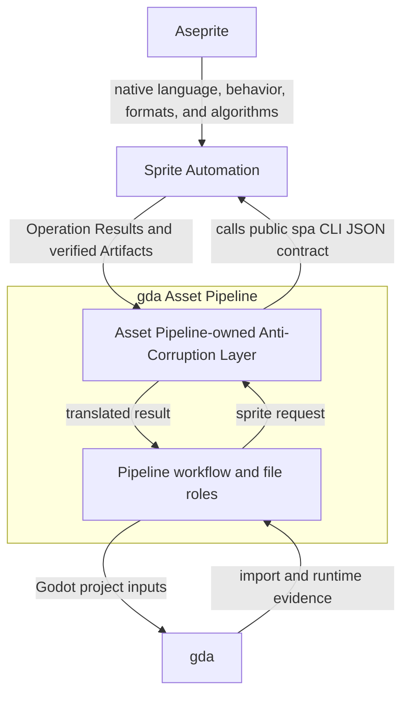
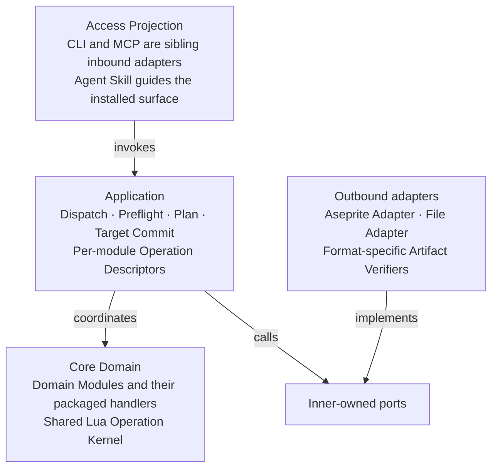
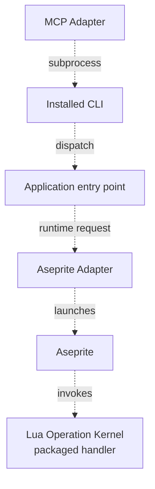
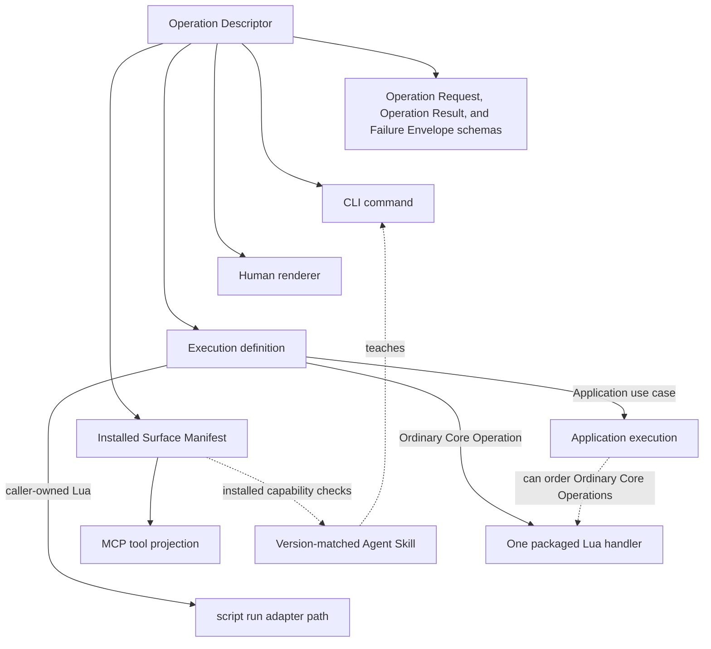
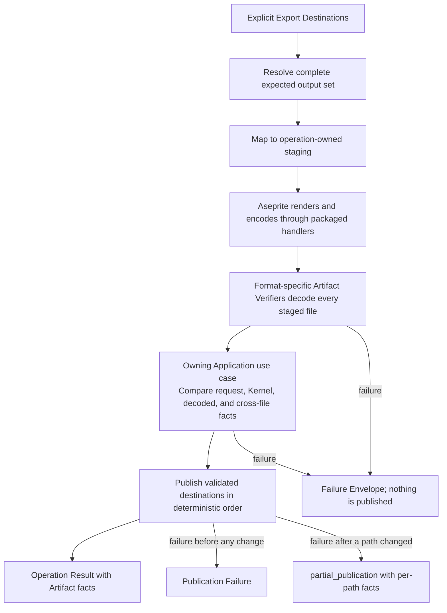

# SPA Architecture

This document presents the current system architecture of Aseprite Automation (`spa`).
It integrates the accepted domain model and architecture decisions into one view for
users and contributors. It describes responsibilities, boundaries, dependencies, and
execution flows without replacing the documents that own individual decisions or
feature contracts.

[`AUTHORITY_MATRIX.md`](AUTHORITY_MATRIX.md) defines the normative sources for every
fact in this integrated view. If this document conflicts with an owning source, update
this view instead of treating it as another decision authority.

> [!IMPORTANT]
> SPA is at the bootstrap stage. The installed CLI exposes `spa info`, `spa version`,
> `spa schema`, Sprite creation and inspection, Layer addressing and creation,
> Frame inspection and authoring,
> bounded Pixel Patch application, and verified RGB PNG Image Export. The module
> ownership below includes both this delivered vertical slice and planned work. Feature
> issues own delivery status, while the installed Surface Manifest reports the callable
> surface of each installation.

The document evolves with the product. An accepted change to the Bounded Context,
module ownership, public contract, execution model, or integration boundary must be
reflected here after its owning artifact changes.

## Architecture at a glance

SPA is an **Aseprite automation toolchain for AI agents**. Its business capability is
equivalent to Aseprite's: it provides agent-facing mechanisms for sprite creation,
editing, inspection, validation, conversion, and export, and develops these functional
capabilities broadly and deeply for agent use.

SPA exposes those capabilities as typed Operations with explicit targets, structured
outcomes, and verifiable Artifacts. It invokes an externally installed Aseprite, which
remains authoritative for native sprite behavior.


Arrows in this overview show runtime collaboration and output flow, not source-code
dependencies. The [logical module architecture](#logical-module-architecture) defines
the source dependency direction.

The primary working loop is:

```text
discover
    -> inspect existing state when applicable
    -> create or edit
    -> inspect and validate the persisted result
    -> continue editing or export
```

The create/edit and inspect/validate steps repeat as the agent refines an asset.

The `spa` CLI is the first Open Host Service. The Agent Skill and planned initial Model
Context Protocol (MCP) adapter project the installed CLI surface instead of defining
parallel behavior. The current delivery plan does not include a standalone REST API or
remote HTTP service. HTTP is not excluded as a future transport: a validated functional
workflow can add bounded Artifact/resource access or MCP transport as another Access
Projection over the same Published Language and Application use cases.

## Architecture drivers

The architecture responds to six product needs:

1. **Aseprite-equivalent business capability.** SPA must make Aseprite creation,
   editing, inspection, validation, conversion, and export practical for agents.
2. **Clear behavior authority.** Aseprite remains authoritative for native objects,
   pixels, Tools, Filters, color, and export behavior. Each packaged Lua handler is the
   authority for its SPA Core Operation Semantics and native mapping.
3. **Explicit agent intent.** An Operation must not depend on active editor objects,
   saved preferences, prompts, or other hidden interactive state.
4. **Machine-readable outcomes.** Inputs, successes, failures, side effects, bounds,
   and installed support must have typed and discoverable representations.
5. **Verifiable persistence.** A process exit is not sufficient evidence. Mutated
   Sprites and exported Artifacts must be staged, inspected, and reported truthfully.
6. **Incremental product growth.** Core functional slices lead architecture growth.
   Supporting and Generic mechanisms grow when delivered capabilities require them.

These drivers come from the
[umbrella product requirements document (PRD)](https://github.com/aigengame/aseprite-automation/issues/1),
the [Ubiquitous Language and context model](CONTEXT.md), and the
[accepted ADRs](docs/adr/).

## Domain-driven design profile

### One Bounded Context

SPA has one **Sprite Automation Bounded Context**. Creation, editing, inspection,
validation, conversion, and export use the same Aseprite object model and the same
agent-facing automation contract. CLI, MCP, Agent Skill, validation, export, runtime
integration, and the Lua Operation Kernel are modules or adapters inside this context;
they are not separate Bounded Contexts.

The system uses Aseprite's public language where Aseprite already names a concept.
SPA adds terms when agent automation needs a distinct public value, lifecycle, or
contract. [`CONTEXT.md`](CONTEXT.md#ubiquitous-language) is the terminology authority.

### Subdomains and investment

| Subdomain | Classification | Responsibility | Investment rule |
| --- | --- | --- | --- |
| Sprite Automation | Core Domain | Agent-facing Aseprite creation, editing, inspection, validation, conversion, export, control, composition, and feedback. | Highest priority; deepen through functional vertical slices. |
| Aseprite Runtime Integration | Supporting | Runtime and resource discovery, process execution, Kernel transport, diagnostics, and native integration facts. | Grow from Core Domain needs and observed runtime variation. |
| Access Projection | Supporting | CLI presentation, Agent Skill guidance, and MCP projection from one operation surface. | Preserve contract equivalence; do not create a second capability model. |
| Asset Pipeline Integration | Supporting | Maintain the public SPA boundary used by the downstream-owned Anti-Corruption Layer. | Follow the stable integration commitment without adopting experimental pipeline internals. |
| Serialization, filesystem, and utilities | Generic | Domain-neutral mechanics required by accepted Operations. Aseprite process execution and policy remain Runtime Integration. | Use proportionate solutions; no independent platform roadmap. |

This priority is a design constraint. Authentication, authorization, audit history,
distributed consistency, multi-tenancy, and similar service infrastructure do not enter
the design without an accepted functional need and operating evidence.

### Context relationships



- **Aseprite is upstream.** SPA shares its native language and delegates native
  behavior through supported non-interactive seams.
- **The Asset Pipeline is downstream.** Its Anti-Corruption Layer translates pipeline
  concepts to the public `spa` CLI JSON contract. Experimental
  pipeline command names and types do not become SPA contracts.
- **gda owns Godot evidence.** SPA can verify a Sprite or exported image, but it does
  not claim Godot import, runtime, gameplay, or player acceptance.
- **Callers own cross-Sprite workflows.** Aggregation, retry, installation, and project
  acceptance remain outside one SPA Operation or Operation Plan.

### Selective use of DDD building blocks

SPA uses Domain-Driven Design (DDD) to assign language and responsibility, not to
reproduce a pattern catalog.

| Building block | SPA use |
| --- | --- |
| Ubiquitous Language | Shares Aseprite terms, records explicit SPA extensions, and defines SPA automation terms. |
| Bounded Context | Keeps one coherent Sprite Automation model and public contract. |
| Domain Module | Owns a cohesive feature family and its reason to change across logical layers. |
| Value Object | Represents explicit values such as Color Value, Selection, Coordinate Space, Pixel Region Snapshot, Tile Placement, and Artifact facts. |
| Application use case | Coordinates work that has no natural native Aseprite object owner, such as Operation Plan execution and publication. |
| Open Host Service and Published Language | Exposes the public `spa` CLI JSON contract and its schemas to agents and downstream consumers. |
| Anti-Corruption Layer | Belongs to the Asset Pipeline and prevents pipeline models from entering SPA. |

SPA does not introduce a database Repository, an event-sourced Aggregate, or a global
event bus. The current product operates on Aseprite documents and local files through
explicit Operations.

## Logical module architecture

The architecture separates logical dependency layers while Domain Modules retain
vertical ownership of their Operations. A Command Group is navigation and does not
define a module boundary.



Solid arrows show permitted source dependency and inward invocation direction. CLI and
MCP are sibling adapters to the same Descriptor-projected Application contract; neither
has a source dependency on the other. In the planned initial runtime path, MCP reaches that
contract through the installed CLI subprocess shown below. Within Application, Dispatch
invokes the selected use case, Plan coordinates Domain behavior, and Commit uses
inner-owned ports. Within Outbound, each adapter depends on the applicable inner-owned
port. Domain and Application source never depends on concrete process, filesystem, MCP,
or CLI types.

Runtime calls are distinct from those source dependencies:



The dashed graph is runtime flow, not source ownership. Each Domain Module owns its
applicable packaged handler source and binding; those handlers carry the module's Core
Operation Semantics inside the shared Lua Operation Kernel. The Aseprite Adapter invokes
the handlers through Aseprite without acquiring their semantics. Bootstrap is the
composition root that alone knows and binds concrete Access, Application, and Outbound
implementations.

The diagram is a responsibility map, not a required directory tree. Physical packages
will follow demonstrated change clusters as vertical slices are implemented.

### Technology profile

The installed CLI uses a replaceable outer stack around stable domain and
public-contract boundaries. [Issue #3](https://github.com/aigengame/aseprite-automation/issues/3)
delivers the bootstrap choices recorded in project metadata and its lockfile; the
Sprite creation and inspection slice extends that same stack.

| Component | Bootstrap choice | Role |
| --- | --- | --- |
| Application runtime | Python 3.13 | Use-case orchestration and adapter coordination. |
| CLI adapter | Typer | Command access and human or machine presentation. |
| Public contracts | Pydantic 2 and JSON Schema | Typed Operation Requests, Operation Results, Failure Envelopes, and discovery schemas. |
| Project and packaging | `uv` | Environments, dependencies, builds, and installed-product tests. |
| Ordinary Core Operations | Packaged Lua handlers | Core Operation Semantics and native mapping executed through Aseprite. The current package contains a fixed runtime probe, shared capability observations, Sprite creation, Sprite inspection, Layer addressing and creation, Frame inspection and authoring, exact Pixel Patch, Export Image, and Operation Plan handlers. |
| Aseprite integration | External `aseprite --batch --script` | Native document, Tool, Filter, color, and export behavior. |
| Private transport | Versioned JSON request and response files | Data exchange through `--script-param`, separate from diagnostics. |
| Agent access | Version-matched Agent Skill and planned local stdio MCP Adapter with CLI subprocess invocation | Guidance and equivalent tool projection from the installed surface. |

These choices can change when implementation or distribution evidence requires it.
The Bounded Context, Published Language, and behavior authority do not depend on one
Python framework or packaging tool.

## Module responsibilities

### Core Domain ownership view

The current view groups Core Domain responsibility into five cohesive areas. They guide
feature ownership and can become Domain Modules as implementation evidence confirms
their change boundaries. The delivered `spa.sprite` vertical slice owns Sprite creation
and structural inspection within Document and Animation; `spa.layer` owns Layer
addressing and creation; `spa.frame` owns Frame inspection and authoring. The delivered
`spa.paint` slice owns exact Pixel Patch application, while `spa.raster` holds the
shared Color Value, Rectangle, Patch, and Selection types. Raster Authoring owns their
pixel and Color Value semantics under ADR-0018; Color and Palette owns Palette and
conversion behavior. The other groupings remain an integrated planning view rather
than a frozen package graph.

| Responsibility area | Owns | Important boundary |
| --- | --- | --- |
| Document and Animation | Sprite; shared Layer, Frame, and Cel identity, addressing, hierarchy, and existence contracts; feature-declared general Layer/Cel Operations; Tag, Slice, timing, and animation Operations. | It does not claim Tilemap Layer creation and binding or Tilemap Cel/Image content; specialized tile variants depend one-way on the shared contracts. |
| Raster Authoring | Shared Color Value semantics, Image observation and transforms, Pixel Region Snapshot and Pixel Patch exchange, Selection value operations, Paint intent, native Tool invocation, native Filters, external raster import, and evidence-gated text rasterization. | Image, Paint, and Filter remain distinct operation families while sharing one pixel and target authority. |
| Color and Palette | Palette Change and Effective Palette behavior, quantization, Color Mode changes, Color Profile assignment/conversion, and Dithering choices. | Preserves native distinctions and makes result-affecting choices explicit. It does not implement a second color engine. |
| Tile Authoring | Grid, Tileset, Tile, Tile Key, Tilemap, Tile Placement, Tilemap Layer creation and binding, Tilemap Cel/Image content, bounded region exchange, and established Tileset-coupled lifecycle variants. | Reuses shared Layer/Cel contracts without duplicating them; support for other Layer/Cel variants remains with the owning feature issue until delivered. |
| Delivery | Static image, animation, sheet, Tileset, preview, and metadata Export Operations with declared destinations and verified Artifacts. | Aseprite renders and encodes; SPA stages, validates, publishes, and reports the complete declared output set. |

An Operation that spans modules is coordinated by Application through public contracts.
Module dependencies must remain acyclic, but this document does not freeze a complete
intra-Core dependency graph before implementation supplies real change and reuse
evidence. Each delivered slice records the owner of a shared value or rule and adds a
one-way dependency to that owner rather than copying the knowledge.

Inspection and Validation stay with the module that owns the inspected concept. They do
not form a horizontal subsystem. Selection authoring stays adjacent to Raster Authoring
while the Selection value can be consumed by other eligible Operations. A future split
requires evidence of a different language and reason to change.

Each Domain Module owns a vertical slice of:

- its domain terms and invariants;
- request, result, and failure contracts;
- Operation Descriptors;
- Application use cases;
- human and machine presentation bindings;
- applicable packaged Lua handler bindings; and
- tests and applicable native integration evidence.

These responsibilities remain logically distinct even when one physical package keeps
them close.

### Operation contract and discovery

Each structured public capability has one **Operation Descriptor**. The descriptor
binds schemas, execution metadata, presentation, and a declared execution definition.
For an Operation that invokes Aseprite, it also declares the required Lua language
profile, minimum `app.apiVersion`, and the Aseprite-provided runtime capabilities that
the Operation actually uses. A complete probe establishes its scripting, file I/O, and
JSON transport prerequisites. It reports native runtime capabilities independently of
those fixed prerequisites. The Application compares the observed Lua language, API
version, and capabilities with the selected Descriptor before it enters an ordinary
Operation execution definition. For Plan, the selected Step Descriptors and mandatory
final Sprite inspection determine the requirements. Shared capability observations and
comparison run inside the single Plan process before its first Step, and Application
maps an incompatibility to the same
typed `runtime_incompatible` failure. Aggregate discovery uses the union of all
currently eligible Step requirements to declare the complete Plan surface supported;
an individual Plan may run with fewer observed capabilities because its execution
gate uses its selected Steps plus final Sprite inspection.
Descriptors are the registration authority; they do not implement native behavior.
Under ADR-0013, the failure contract uses shared registration of each public
Failure Code's meaning, Category, and Details kind. Each Descriptor declares its
Operation's applicable codes and projects their constraints in its failure schema.
Before Descriptor selection, the CLI constructs usage failures from that registration;
aggregate `spa schema` discovery exposes their separate Access-level failure schema.
The Application classifies private runtime evidence for selected Operations; Access
adapters project the same Failure Envelope.

Each standalone Ordinary Core Operation binds one fixed packaged Lua handler. A capability whose
behavior is implemented by an Application use case can have no Kernel binding. An
application-composed capability can order packaged semantic entry points through its
own fixed handler without redefining their semantics. `script run` uses a separate caller-script
path. SPA registration, identity resolution, and Ordinary Core Operation dispatch cannot
use that path to replace, override, rewrite, proxy, or bypass an existing Ordinary Core
Operation.

Every Descriptor declares Operation Determinism. `deterministic` and
`native-stochastic` apply to `read`, `mutation`, and `export`; only `script-run` can
declare `caller-defined`. That value states that SPA makes no claim about the caller's
script repeatability or randomness source. All other Execution Kinds prohibit it.



The installed Surface Manifest reports the callable Operations, schemas, execution
metadata, version constraints, and Capability Gaps for one SPA and Aseprite combination.
It is runtime truth, not a product roadmap.

### Application orchestration

Application use cases own the order of work around native behavior:

- validate public input and resolve public omission/null semantics;
- select and order packaged capabilities;
- discover a compatible Aseprite runtime;
- coordinate Operation Plan Steps;
- prepare staging paths and explicit destinations;
- classify protocol, process, and verification failures;
- publish a Target Sprite File or exported Artifacts after verification; and
- return one typed outcome for access adapters to project.

Python can perform this orchestration. It cannot duplicate Core Operation Semantics
owned by a packaged Lua handler, substitute for Aseprite's native behavior, or create a
temporary Lua implementation for an Ordinary Core Operation.

### Lua Operation Kernel

The versioned, packaged Lua Operation Kernel is the authority for Core Operation
Semantics executed inside Aseprite. Its handlers:

- resolve live Sprite targets and native side effects;
- enforce document-dependent Preconditions and Postconditions;
- execute supported native transactions, Tools, Filters, color operations, and exports;
- install and restore invocation-local editor, Tool, Filter, and visibility state;
- observe the resulting native state; and
- return a versioned private Kernel response.

Standalone handlers and the Plan handler call the same packaged native semantic entry
points. Standalone handlers save and reopen their Operation output; the Plan handler
keeps one Sprite live and applies one final save-and-reopen gate. A second Python or
generated-Lua behavior path is prohibited. `spa script run` is a separate escape hatch
for exact caller-owned Lua and does not inherit Ordinary Core Operation guarantees.

### Aseprite Runtime Integration

The Aseprite Adapter owns the external integration mechanics:

- executable and resource discovery;
- host-specific invocation preparation within the adapter;
- collection and transport of the Aseprite version, embedded Lua language version,
  `app.apiVersion`, fixed probe prerequisites, and independently observed runtime
  capabilities;
- `--batch --script` process launch;
- the versioned Kernel Protocol and transport files;
- process exit and bounded diagnostic capture;
- process-environment and transport-file cleanup; and
- process, protocol, and runtime-integration observations required by an Operation.

Process exit and standard output are runtime observations, not the public verdict. The
Application maps those observations to an Operation Result or Failure Envelope.

Invocation preparation keeps the installed executable's canonical path separate from
the path used to start one process. For macOS `.app` CLI invocations, the adapter
creates a temporary non-bundle link to the executable and a link to its `data`
resources. Other installation shapes use the installed executable directly. The
adapter supplies an isolated Aseprite user folder and cleans these temporary paths.
This private mechanism does not change the caller's sandbox, the installed app, or
the File Adapter's ownership of Sprite and Artifact paths. [Issue #61](https://github.com/aigengame/aseprite-automation/issues/61)
defines the targeted restricted profile and its evidence requirements. Tests retain
the executed integration evidence.

### File and Artifact verification integration

The **File Adapter** owns domain-neutral path handling, staging, existence, byte size,
digest, publication, and cleanup. It does not decode a File Format or interpret Sprite
semantics. A format-specific **Artifact Verifier** independently decodes typed observed
facts from staged Artifact bytes; it does not define the expected result. The owning
Domain Module defines the expected format and domain facts, and the Application use case
compares the request, Kernel observations, verifier observations, and applicable
cross-file facts before publication.

These responsibilities support two separate functional boundaries:

- **Sprite Mutation:** prepare a Staged Sprite File and perform one Target Commit after
  the Application obtains persisted native facts from a close-and-reopen cycle in the
  owning Aseprite invocation.
- **Export:** stage the complete declared output set, decode and compare every expected
  file, then publish and report verified Artifacts.

These mechanisms do not create a persistent Artifact registry, backup store, audit
history, or cross-command recovery system.

### Access Projection

- The **CLI** is the first public execution channel for the public `spa` CLI
  JSON contract.
- The **Agent Skill** teaches discovery and the edit-observe-verify-export loop for the
  installed surface.
- The **MCP Adapter** reads the Surface Manifest, invokes `spa`, and relays equivalent
  requests and outcomes.

The planned initial MCP slice uses stdio between the MCP client and adapter. The adapter invokes
the installed `spa` CLI as a subprocess; it does not require a REST or HTTP intermediary.
MCP image and resource content is projected through MCP itself and does not require an
HTTP file service.

MCP does not call the Lua Kernel directly and does not own schemas, failure meanings, or
feature taxonomy. A later MCP Streamable HTTP transport or bounded HTTP resource adapter
would be a sibling inbound adapter, not a mandatory `MCP -> REST -> CLI` layer. Every new
access channel must project the same Published Language and cannot become an Operation
semantics authority. Network-facing requirements enter the design only with the
functional slice that creates them.

### Asset Pipeline boundary

SPA owns Aseprite and sprite-asset semantics. The downstream Asset Pipeline owns
workflow order, concept/reference handoff, file roles, installation, retry, and project
acceptance. Its Anti-Corruption Layer calls the public `spa` CLI JSON contract and translates the
result into pipeline concepts. This commitment remains stable while the pipeline's
experimental commands and tactical types evolve.

## Public and private contracts

| Contract | Visibility | Authority and purpose |
| --- | --- | --- |
| Published Language | Public | Versioned Operation Request, Operation Result, Failure Envelope, Operation metadata, Artifact, and Surface Manifest schemas. |
| Operation Descriptor | Internal registration, publicly projected | Binds one structured public capability's identity, schemas, metadata, presentation, and declared execution definition. |
| Kernel Protocol | Private | Carries versioned data between Python and the packaged Lua Kernel; it can evolve without becoming a second public API. |
| Operation Result | Public success | Reports verified domain facts and produced Artifacts. |
| Failure Envelope | Public failure | Provides stable Failure Code and Category, typed Details where useful, and human Diagnostics. |
| Surface Manifest | Public discovery | Reports what the installed SPA/Aseprite combination can call. |

Before SPA 1.0, the co-packaged Python and Lua components use only the current Kernel
Protocol version. This private boundary can evolve without historical-version
compatibility machinery; checking the installed Aseprite Lua runtime and scripting
API remains a separate obligation.

These are three independent compatibility axes. The packaged Kernel currently declares
the `Lua 5.4` language profile. Each runtime-backed Descriptor declares its minimum
`app.apiVersion` and required Aseprite-provided capabilities. The Adapter observes the
selected process. A successful probe establishes its transport prerequisites; a
prerequisite failure uses the existing typed process or Kernel failure channel. The
Adapter preserves each independently observed runtime capability rather than requiring
every known capability for every probe. The Application rejects an observed
Lua-language or API-version mismatch, or a capability missing from the selected
Descriptor's requirements, with typed evidence before Operation execution. The private
Kernel Protocol continues to require an exact match with the one version co-packaged in
the same pre-1.0 release.

A completed Validation can return an Operation Result with typed Validation Findings.
An invalid request, execution failure, or unmet commit gate returns a Failure Envelope;
a Finding is not a command failure.

Public targeting is operation-specific. SPA does not define a universal Selector,
Locator, query language, or cardinality framework because Aseprite objects have
different identity and lifecycle rules. Each Operation defines exact target fields and
target-count rules, and Operation Results report current address and impact facts.

## Execution flows

### Ordinary Core Operation mutation

```mermaid
flowchart TB
    Request["Caller<br/>Typed Operation Request"]
    Inbound["CLI / inbound adapter<br/>Validate and translate request"]
    Preflight["Application use case<br/>Preflight schemas, paths, limits, and eligibility"]
    Discover["Application and Aseprite Adapter<br/>Discover compatible runtime"]
    Stage["Application and File Adapter<br/>Prepare Staged Sprite File"]
    Invoke["Aseprite Adapter<br/>Invoke bound packaged handler"]
    Resolve["Packaged Lua Kernel in Aseprite<br/>Resolve targets and native side effects"]
    Execute["Packaged Lua Kernel in Aseprite<br/>Execute native transaction and Postconditions"]
    Persist["Packaged Lua Kernel in Aseprite<br/>Save, close, reopen, and observe persisted facts"]
    Evidence["Aseprite Adapter to Application<br/>Return Kernel response, process status, and diagnostics"]
    Verify["Application use case<br/>Validate Kernel response and persisted Postconditions"]
    FileFacts["File Adapter<br/>Validate staged path, bytes, and digest"]
    Commit["Application and File Adapter<br/>Target Commit"]
    Result["Caller<br/>Operation Result"]

    Request --> Inbound
    Inbound --> Preflight
    Preflight --> Discover
    Discover --> Stage
    Stage --> Invoke
    Invoke --> Resolve
    Resolve --> Execute
    Execute --> Persist
    Persist --> Evidence
    Evidence --> Verify
    Verify --> FileFacts
    FileFacts --> Commit
    Commit --> Result
```



Any failure before publication produces a Failure Envelope and no Target Commit.

An Ordinary Core Operation with Execution Kind `mutation` resolves and validates its
complete effective target set before it changes the Sprite. Native Linked Cel or Tileset
effects are included in that scope. Supported changes run inside an Aseprite transaction;
staged replacement protects the declared file target. Save, close, reopen, and persisted
observation occur before the one Aseprite invocation returns.

### Operation Plan

An Operation Plan applies eligible read and mutation Operations to one in-memory Sprite
in one Aseprite invocation and adapter unit of work.

```text
Plan Preflight
    -> selected Step and final inspection capability observation and check
    -> Step 1 Preconditions -> shared semantic entry point -> Step 1 Postconditions
    -> Step 2 Preconditions -> shared semantic entry point -> Step 2 Postconditions
    -> ...
    -> Plan Postconditions
    -> zero commits for a read Plan, or one Target Commit for a mutation Plan
```

A later Step can target an object created by an earlier Step, so live target resolution
occurs immediately before each Step. Only Sprite-bound read and mutation Operations
whose Descriptors declare Plan eligibility can be Steps. Export and `script run` are
not eligible. Cross-Sprite workflow, retry, and partial success remain outside the Plan
model.

### Export publication



Static image export uses a fixed private composition order for Layer Composition,
Color Profile, Palette preparation, Color Mode, transparency or Background behavior,
and File Format encoding. Other export families own their own feature contracts. Export
never mutates the Source Sprite.

A successful result reports the complete declared output set. When an Export has
several final paths, SPA publishes them in a deterministic order. A failure after a
final path changed returns `partial_publication` with the known state of every declared
destination and whether a published path replaced an existing file. SPA does not return
a successful Artifact set, restore replaced files, remove published files, or promise
filesystem atomicity or a general recovery mechanism. A hard interruption can leave
the final state indeterminate; a later request observes existing paths through its
normal explicit `if_exists` policy.

## Invariants and their owners

| Invariant | Knowledge owner | Execution owner |
| --- | --- | --- |
| Public capability has one registration source. | Operation Descriptor. | Descriptor projection into CLI, MCP, and Surface Manifest; Agent Skill checks against the installed surface. |
| Native object and algorithm behavior follows one upstream authority. | Aseprite public semantics and native behavior. | Aseprite, invoked and observed by a packaged handler. |
| Each Ordinary Core Operation has one Core Operation Semantics authority. | Before delivery, its feature issue owns the exact contract under applicable ADR constraints. After delivery, its Descriptor owns the implemented public contract and binding, while tests and evidence artifacts own executed behavior proof. | Its fixed packaged Lua handler is the sole executable Core Operation Semantics authority; Application only invokes and orchestrates it. |
| Public intent does not depend on hidden editor state. | Owning Operation contract. | Python Preflight plus Kernel target and state handling. |
| Success and failure are disjoint typed outcomes. | Published Language and result/failure decision. | Application outcome mapping and adapters. |
| Inspection success is complete for its normalized scope. | Owning inspection Operation. | Kernel observation and Application limit handling. |
| An Ordinary Core Operation with Execution Kind `mutation` is all-or-nothing for its resolved target set. | Mutation decision and owning Operation. | Kernel transaction, persisted native inspection, Staged Sprite File preparation, and Target Commit. |
| Export success reports a complete verified Artifact set. | Export publication decision and feature contract. | Kernel native export; Artifact Verifier decoding; Application semantic comparison; File Adapter publication. |
| Capability Gaps remain visible and versioned. | Installed Surface Manifest for installed Capability Gaps; feature issue for planned candidate-gap handling and evidence requirements. | Aseprite Adapter collection of runtime observations; tests and evidence artifacts retain executed proof; Surface Manifest generation reports installed Gaps. |

## Failure, bounds, and trust

SPA assumes a trusted local caller, workspace, packaged Operation set, and Aseprite
installation. It provides functional control appropriate to that environment:

- stable failure codes and typed details;
- Operation Limits expressed in native units such as pixels, Tile Cells, Frames, or
  Plan Steps;
- process timeout and captured-output Execution Guards;
- explicit Source Sprite File, Target Sprite File, in-place intent, overwrite behavior,
  and Export Destination;
- native transactions, staged files, Postconditions, and independent output checks; and
- bounded Diagnostics separated from machine output.

These mechanisms serve sprite Operations. They do not establish authentication,
authorization, multi-tenant isolation, distributed locking, service governance,
persistent provenance, or generalized recovery. Caller-owned Lua is unrestricted and
does not carry a sandbox claim.

## Architecture evolution

The project develops through evidence-bearing vertical slices. Delivery begins with an
end-to-end CLI slice and then deepens the same architecture across sprite authoring,
observation, validation, delivery, agent access, and Asset Pipeline integration.
Feature issues own the exact scope and explicit dependencies of those slices.
Milestones group phase outcomes, and explicit issue dependencies determine implementation
order.

[`AUTHORITY_MATRIX.md`](AUTHORITY_MATRIX.md) defines the update order and the owner of
each changed fact. This document changes after the applicable normative source changes
and labels planned, implemented, and installed facts by their owning source.

A new Bounded Context, service, event mechanism, generic abstraction, or compatibility
layer requires evidence that the current model cannot express an accepted functional
need. Physical packages can change as implementation reveals better cohesion, while
the responsibility and dependency rules remain stable until an accepted decision
changes them.

## Decision map

This map is navigation, not a second decision record.

| Concern | Decisions |
| --- | --- |
| Strategic-context decisions and rationale; current model in `CONTEXT.md` | [ADR-0001](docs/adr/0001-single-sprite-automation-context.md), [ADR-0007](docs/adr/0007-demand-driven-nfrs.md), [ADR-0009](docs/adr/0009-command-groups-and-domain-modules.md) |
| Operation contract, Plan, targets, limits, and outcomes | [ADR-0002](docs/adr/0002-operation-descriptor-authority.md), [ADR-0003](docs/adr/0003-operation-plan-boundary.md), [ADR-0006](docs/adr/0006-operation-targets-and-identity.md), [ADR-0008](docs/adr/0008-operation-owned-bounds.md), [ADR-0013](docs/adr/0013-result-and-failure-contract.md) |
| Kernel authority and mutation publication | [ADR-0010](docs/adr/0010-lua-operation-kernel-authority.md), [ADR-0014](docs/adr/0014-mutation-file-semantics.md) |
| Document, animation, color, and selection semantics | [ADR-0021](docs/adr/0021-frame-numbering.md), [ADR-0024](docs/adr/0024-color-values-and-conversion.md), [ADR-0025](docs/adr/0025-coordinate-spaces-and-rectangles.md), [ADR-0028](docs/adr/0028-background-layer-and-cels.md), [ADR-0029](docs/adr/0029-selection-as-explicit-value.md), [ADR-0033](docs/adr/0033-tag-playback-semantics.md), [ADR-0035](docs/adr/0035-palette-time-semantics.md), [ADR-0039](docs/adr/0039-slice-model-and-addressing.md) |
| Raster, Tile, Paint, and Filter semantics | [ADR-0018](docs/adr/0018-raster-authoring-boundary.md), [ADR-0041](docs/adr/0041-tileset-and-tile-identity.md), [ADR-0044](docs/adr/0044-tilemap-and-placement-semantics.md), [ADR-0047](docs/adr/0047-preserve-tile-meaning-across-tileset-lifecycle.md), [ADR-0051](docs/adr/0051-shared-image-resize-transform.md), [ADR-0057](docs/adr/0057-canonical-pixel-region-snapshot.md), [ADR-0060](docs/adr/0060-private-native-tool-invocation.md), [ADR-0066](docs/adr/0066-declare-native-stochastic-operations.md), [ADR-0074](docs/adr/0074-shared-native-filter-semantics.md) |
| Color operations and export publication | [ADR-0085](docs/adr/0085-stage-and-verify-explicit-export-destinations.md), [ADR-0089](docs/adr/0089-native-color-operation-boundaries.md), [ADR-0094](docs/adr/0094-export-image-semantics-and-operation-order.md) |

For product scope, see [PRD #1](https://github.com/aigengame/aseprite-automation/issues/1).
For candidate command territory, see the [command catalog](docs/command-catalog.md).
For phase outcomes, see the
[milestones](https://github.com/aigengame/aseprite-automation/milestones). For feature
contracts, explicit dependencies, and delivery status, see the
[feature issues](https://github.com/aigengame/aseprite-automation/issues).
