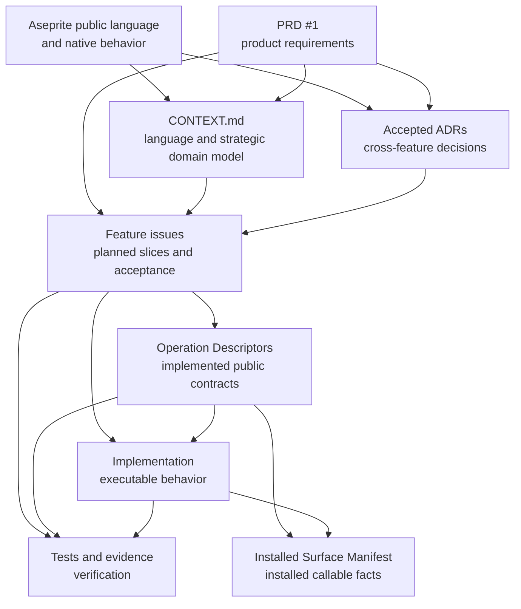
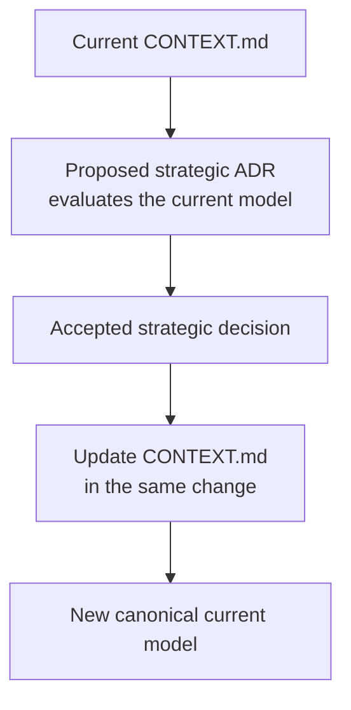
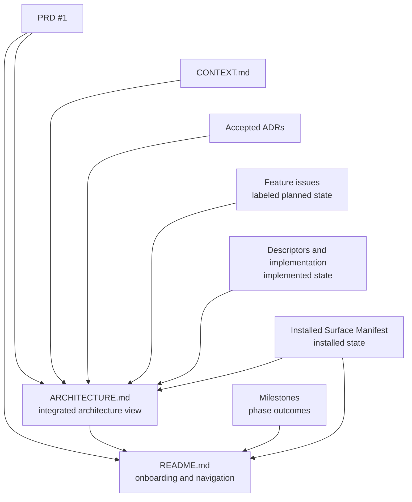
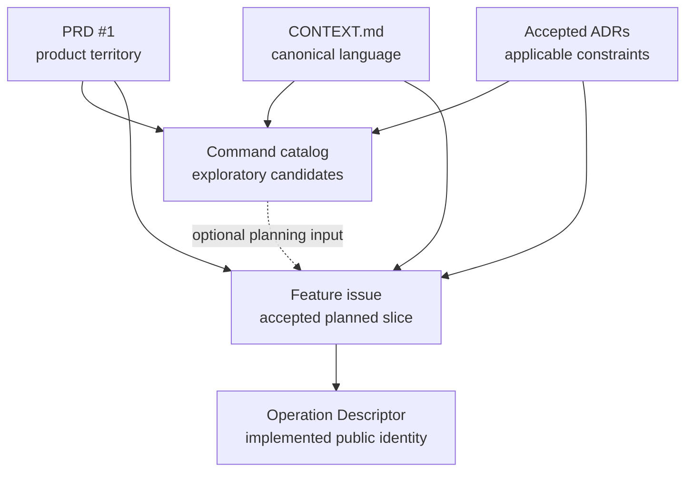

# SPA authority matrix

This document is the repository authority-governance entry for Aseprite Automation
(SPA) product and system knowledge. `SPA` is the short project name used in
documentation; `spa` is the executable. The matrix assigns each normative fact to one
owner and separates normative authority from integrated or user-facing views and
exploratory input.

When two artifacts disagree about a normative fact, identify the fact type in this
matrix and correct the non-owning artifact. An integrated view, user-facing view, or
exploratory artifact never overrides the source of that fact.

An ignored local `STATE.md`, when present, is a transient worker report outside this
tracked authority graph. It derives current execution status from Git, PRs, issues,
milestones, and durable authorities; it does not own product or system knowledge.

## Normative authorities

| Authority | Owns | Does not own | Depends on or supplies |
| --- | --- | --- | --- |
| Aseprite public language and native behavior | Native terms, object model, editor and scripting semantics, file formats, and native algorithms. | SPA product scope, public automation contracts, or delivery status. | Supplies the upstream semantic base for `CONTEXT.md`, ADRs, feature work, and implementation evidence. |
| [PRD #1](https://github.com/aigengame/aseprite-automation/issues/1) | Product problem, users, outcomes, stable requirement numbers, product constraints and non-goals, and prototype provenance. | Durable architecture mechanisms, exact feature contracts, acceptance matrices, implementation order, delivery status, or shipped support. | Supplies product requirements to strategic design and feature issues. |
| [`CONTEXT.md`](CONTEXT.md) | Ubiquitous Language and the canonical current Sprite Automation Bounded Context, Subdomains, context relationships, and strategic domain ownership. | Repository-document governance, decision history and rationale, tactical architecture, feature acceptance, implementation detail, or runtime support. | Uses Aseprite semantics, product requirements, and accepted strategic decisions; constrains ADRs, issues, source, tests, and derived documentation. |
| [Accepted ADRs](docs/adr/) | Consequential cross-feature decisions, their rationale and trade-offs, and durable invariants. | The canonical current strategic model, product backlog, exhaustive feature fields, test matrices, probe logs, delivery status, or shipped support. | Evaluate change against the PRD and current domain model; constrain feature issues and implementation. An accepted strategic-model change updates `CONTEXT.md` in the same change. |
| [Feature issues](https://github.com/aigengame/aseprite-automation/issues) | Exact planned vertical-slice scope, feature contract, acceptance, dependencies, priority, evidence requirements, provenance links, curated evidence summaries, and delivery status. | Executed verification assertions or results, cross-feature architecture, milestone membership rules, or installed-runtime truth. | Refine PRD requirements under `CONTEXT.md` and accepted ADRs; direct delivery and identify required evidence. |
| [Milestones](https://github.com/aigengame/aseprite-automation/milestones) | Phase outcomes and issue membership. | Feature contracts, implicit dependency order, architecture, or implementation truth. | Group issues; explicit issue dependencies remain authoritative for order. |
| Operation Descriptor | Implemented public Operation identity, request/result/failure schemas, metadata, presentation bindings, and execution binding. | Executable native behavior, candidate territory, or installed-environment facts. | Implements an accepted issue contract and supplies public projections and the installed Surface Manifest. |
| Implementation | Executable behavior. For an Ordinary Core Operation, its fixed packaged Lua handler is the sole executable Core Operation Semantics authority. Application code owns application-use-case orchestration without duplicating those semantics. | Product intent, planned scope, or independent public-contract definitions. | Implements issues and Descriptors under accepted ADR constraints. |
| Tests and evidence | Executed verification assertions, observations, measurements, and retained results about contracts, behavior, integration, packaging, and regressions. | Product meaning, evidence requirements, executable behavior, or an independently editable contract. | Verify the applicable issue, Descriptor, implementation, and native claim; supply results that issues can link to and summarize. |
| Installed Surface Manifest | Callable Operations, schemas, execution metadata, version constraints, and Capability Gaps for one installed SPA and Aseprite combination. | Roadmap, priority, design rationale, historical evidence, or unsupported candidates. | Is generated from installed Descriptors, the shared Failure Code registration for Access-level failure projection, and observed runtime facts. |

Ordinary Core Operation and Core Operation Semantics name the packaged execution
category defined in `CONTEXT.md` and ADR-0010. Their authority applies to native
Operations in both Core and Supporting Subdomains; ADR-0095's strategic classification
does not change execution or verification ownership.

The normative delivery flow is vertical:

The arrows show constraint, refinement, implementation, generation, or verification.
They do not make an upstream artifact responsible for the downstream fact.

`CONTEXT.md` is the canonical current strategic model. An ADR owns the decision and
rationale that establishes or changes that model. A proposed ADR starts from the current
model; when the decision is accepted, the same change updates `CONTEXT.md`. This update
rule preserves decision history without making an ADR a second current-model authority.

That strategic-model change is a temporal lifecycle, not a timeless dependency cycle:

## Integrated and user-facing views

These documents have distinct communication responsibilities. They own their
organization, emphasis, explanations, diagrams, and reader experience. Their product,
architecture, delivery, and runtime claims still derive from the applicable normative
sources.

| View | Owns | Factual sources | Does not own |
| --- | --- | --- | --- |
| [`ARCHITECTURE.md`](ARCHITECTURE.md) | Integrated explanation of the current domain, modules, dependencies, contracts, and flows, including its diagrams and reader-oriented organization. | PRD #1, `CONTEXT.md`, accepted ADRs, and explicitly labeled planning, implementation, or installed-state sources. | New product requirements, architecture decisions, feature contracts, delivery status, or installed support. |
| [`README.md`](README.md) | User-facing product introduction and promotion, value-proposition narrative, onboarding, adoption guidance, current-status summary, and navigation. | PRD #1, this matrix, `ARCHITECTURE.md`, milestones, and the installed Surface Manifest when available. | Independent product requirements, architecture decisions, feature contracts, delivery status, or installed support. |

Normative facts flow into these views in one direction; the views add communication,
not a competing fact source:

If a source changes, update the source first and then update each affected view. The
README and Architecture document can improve how facts are explained without changing
the facts themselves. Do not resolve drift by adding a competing normative rule to
either view.

## Exploratory input

The [`docs/command-catalog.md`](docs/command-catalog.md) file records current candidate
capability territory, Command Group navigation, and candidate spellings. It is an
optional input to feature planning. It is not a commitment, contract, schema registry,
Capability Gap register, delivery-status source, or shipped-support source.

A feature issue can adopt, rename, split, combine, or reject a catalog candidate. Once
implemented, the Operation Descriptor owns the public identity. The catalog can retain
or revise the candidate map, but it cannot override either authority.

## Capability fact lifecycle

Related statements at different stages are different fact dimensions:

| Fact | Authority |
| --- | --- |
| Candidate capability or spelling | Command catalog, as exploratory input only. |
| Accepted planned slice and acceptance | Feature issue. |
| Implemented public Operation contract | Operation Descriptor. |
| Executable behavior | Implementation; fixed packaged Lua handler for Ordinary Core Operation Semantics. |
| Evidence requirement, provenance link, or curated evidence summary | Feature issue. |
| Executed verification assertion, observation, measurement, or result | Tests and evidence. |
| Availability in one installation | Installed Surface Manifest. |

This lifecycle does not permit two current owners for the same fact. For example, a
feature issue owns a planned contract, while a Descriptor owns the implemented
contract; the installed Surface Manifest only reports whether that implementation is
callable in one environment.

A Capability Gap reports evidenced unavailability within the applicable SPA support
boundary. Its selected Aseprite version identifies the installation. Evidence for a
bounded native-behavior refusal identifies the tested baseline; evidence from a
selected-runtime observation describes that installation's probe or rejection.
Baseline evidence does not assert a separate native test on every release. A
delivered Operation's documented refusal can remain in the Manifest under
Aseprite's native compatibility policy. An uninvestigated candidate stays in its
feature issue without an invented Gap. Absence of a Gap does not establish that a
candidate is callable. This projection rule adds no SPA version certification matrix.

## Maintenance rules

1. Change the normative owner of a fact first.
2. Update every affected integrated or user-facing view after the owning change.
3. Update the command catalog only when candidate territory or navigation changes.
4. Preserve one-way dependencies; do not let a source derive its meaning from its own
   projection.
5. Resolve conflicts by fact type and owner. Do not create a second matrix, glossary,
   decision, feature contract, or runtime-support registry to reconcile drift.

The [`ARCHITECTURE.md` Decision map](ARCHITECTURE.md#decision-map) is navigation to the
current accepted ADR set. Each ADR remains the authority for its named decision.
